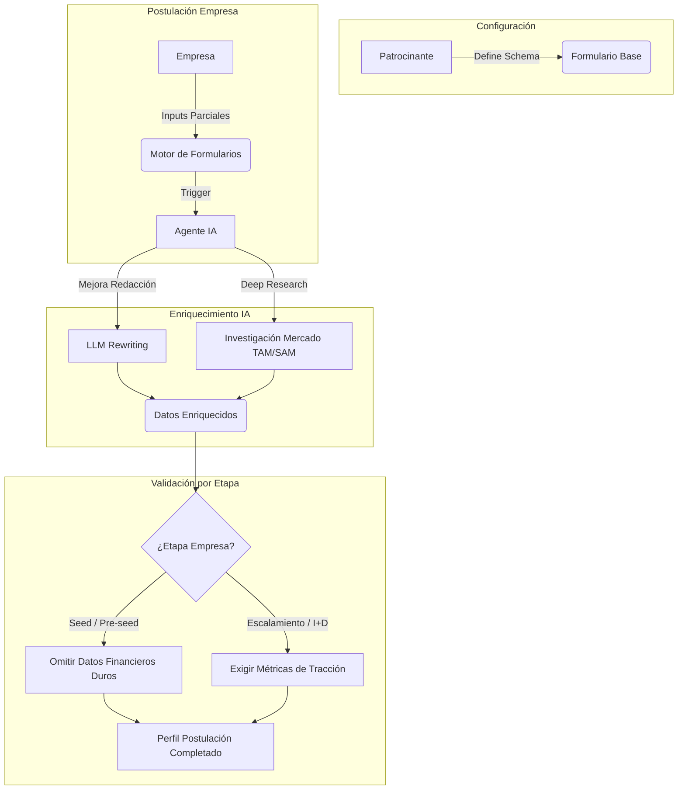
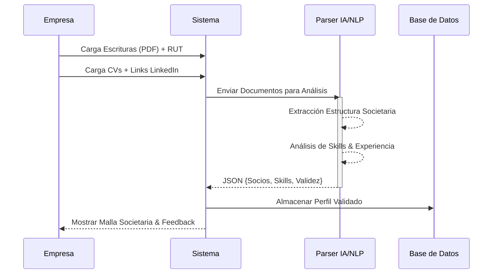
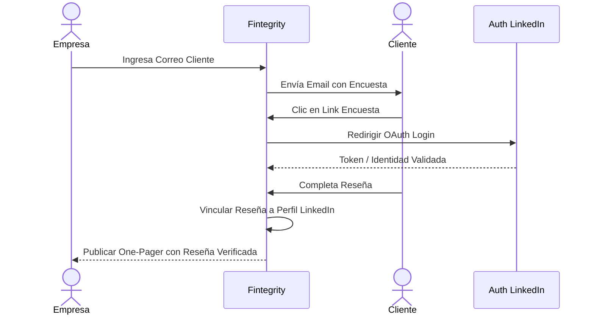
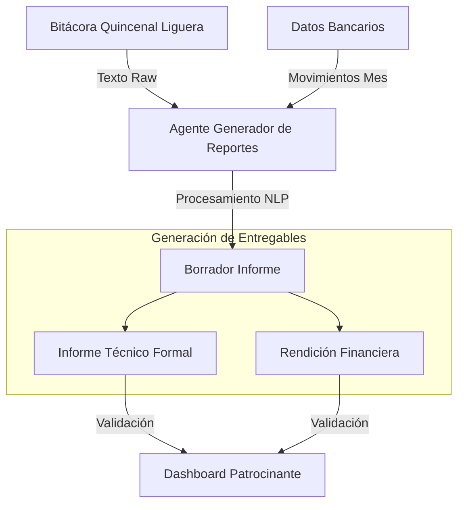
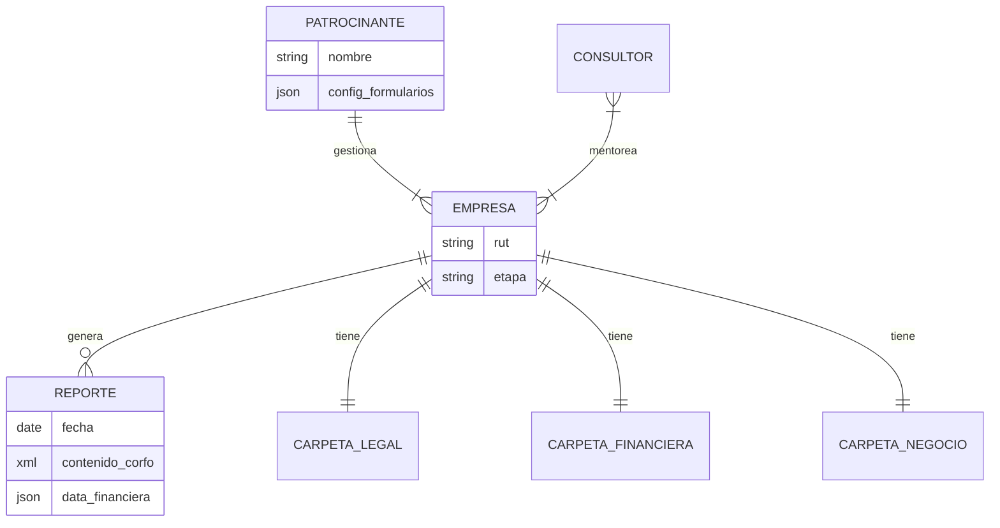

# Briefing Técnico: Desarrollo Plataforma Fintegrity

Este documento detalla la arquitectura, flujos de datos y lógica de negocio para el desarrollo de **Fintegrity**. El sistema se centra en la automatización mediante IA y la integración de APIs para facilitar la gestión entre empresas, patrocinantes e inversionistas.

---

## 1. Núcleo del Sistema: Motor de Formularios Dinámicos

La arquitectura no es estática. El modelo de datos debe adaptarse dinámicamente según el instrumento (fondo/concurso) configurado por el Patrocinante.

### Lógica de Negocio
1.  **Configuración (Patrocinante):** Define el esquema de preguntas y requisitos (Schema Definition).
2.  **Input Mejorado (Empresa + IA):**
    *   La empresa responde preguntas base.
    *   **LLM Middleware:** Refina la redacción y claridad.
    *   **Deep Research Agent:** Busca automáticamente datos faltantes (e.g., TAM/SAM/SOM) para enriquecer la postulación.
3.  **Bifurcación por Etapa (Conditional Logic):**
    *   **Seed/Pre-seed:** Se desactivan validaciones estrictas de ventas/flujo de caja.
    *   **Escalamiento/I+D:** Se fuerzan los módulos de tracción comercial y financiera.

### Diagrama de Flujo: Procesamiento de Formularios



---

## 2. Módulo Legal (Carpeta Legal)

Servicio encargado de la validación de identidad (KYC/KYB) y análisis de capacidades del equipo.

### Flujo de Datos
*   **Inputs:** RUT, PDFs (Escrituras), URLs (LinkedIn), Archivos (CVs).
*   **Procesamiento:** Parser de documentos + NLP para extracción de entidades en CVs y LinkedIn.
*   **Outputs:** Grafo de Malla Societaria y Perfil de Capacidades (Skill Matrix).

### Diagrama de Secuencia: Validación de Equipo



---

## 3. Módulo Financiero (Carpeta Financiera)

Monitorización pasiva y automática. Privacidad y seguridad son críticas aquí.

### Integraciones
*   **SII scraping/API:** Para Formulario F29 (IVA/Ventas).
*   **API Bancaria (Ley Fintech):** Lectura de movimientos en cuenta corriente.

### Lógica de Cálculo
*   **P&L Generator:** Construcción automática de Estado de Resultados.
*   **Financial Metrics Engine:**
    *   `Burn Rate` = (Gastos Operativos Promedio).
    *   `Runway` = (Saldo Caja Actual / Burn Rate).
    *   **Excepción Seed:** Si `Ventas == 0` o `Etapa == Seed`, forzar indicadores a `0` o `null` (display "No Aplica") para evitar bloqueos.

### Diagrama de Flujo de Datos Financieros

```mermaid
flowchart LR
    subgraph "Fuentes Externas"
        SII[SII (F29)]
        Bank[API Banco]
    end

    subgraph "Ingesta & Procesamiento"
        SII & Bank -->|Raw Data| ETL[ETL Processor]
        ETL -->|Datos Normalizados| Calc[Motor de Cálculo Financiero]
    end

    subgraph "Lógica de Negocio"
        Calc --> Check{¿Es Seed?}
        Check -- Sí --> Zero[Set Metrics = 0 / N/A]
        Check -- No --> Formulas[Calc: Burn Rate, Runway, P&L]
    end

    subgraph "Dashboard"
        Zero & Formulas --> UI[Dashboard Financiero]
    end
```

---

## 4. Módulo de Negocio y Reputación

Gestión de la prueba social y resumen ejecutivo validado.

### One-Pager Inteligente
Documento vivo generado automáticamente cruzando:
1.  Visión de la empresa (Input manual/IA).
2.  Datos duros validados (Financiero).
3.  Capacidades de equipo (Legal).

### Flujo de Reseñas Verificadas (Anti-Fraude)
El sistema utiliza LinkedIn como proveedor de identidad para validar que quien reseña es una persona real.



---

## 5. Pipeline de Seguimiento y Reportes

Automatización del reporting ("Pain Killer" para founders). Transforma inputs informales en reportes formales.

### Pipeline de Transformación
1.  **Input (Bitácora):** Texto libre o bullet points simples (Logros, Bloqueos, Next Steps) cada 15 días.
2.  **Procesamiento IA:**
    *   Expansión de texto a prosa formal.
    *   Cruce con datos financieros del periodo.
3.  **Outputs:**
    *   **Informe Técnico:** Formato oficial CORFO/Fondo.
    *   **Informe Financiero:** Rendición de gastos automatizada (Match movimientos banco vs presupuesto).



---

## 6. Matriz de Control de Acceso (RBAC)

Definición de roles y alcance de datos.

| Rol | Acción Principal | Acceso a Datos | Scope |
| :--- | :--- | :--- | :--- |
| **Empresa** | Postula, conecta APIs, llena bitácora | **Write:** Propio<br>**Read:** Propio | `Private` |
| **Patrocinante** | Configura forms, monitorea | **Read:** Agregado (Portafolio)<br>**Write:** Configuración | `Portfolio-Level` |
| **Consultor** | Sube actas, feedback | **Read:** Asignados<br>**Write:** Comentarios/Actas | `Assigned-Level` |

### Modelo Relacional Simplificado




# SEMILLA INICIA CORFO 2026 POSTULACIÓN (Fase 2):

# Fintegrity: Plataforma de Validación de Solvencia mediante IA Multimodal

> **Estado del Proyecto:** Postulación Semilla Inicia 2026  
> **Categoría:** Deep Tech / Fintech / AI  
> **Stack:** Python (PyTorch), Open Finance APIs, React.

---

## 1. Resumen Ejecutivo
**Fintegrity** es una infraestructura de auditoría algorítmica que reemplaza el análisis financiero manual por agentes de **Deep Reinforcement Learning (Deep RL)**. Utilizando el marco de la **Ley Fintech 21.521 (Chile)**, conectamos datos bancarios inmutables con análisis conductual del equipo fundador para emitir un "Sello de Confianza" dinámico en tiempo real.

---

## 2. Flujo de Usuario
El siguiente diagrama describe la interacción desde que la Startup conecta sus cuentas hasta que el Inversionista recibe el análisis de riesgo.

```mermaid
graph TD
    %% Nodos de Usuario
    User([Founder Startup]) -->|1. Login & Auth| Frontend[Plataforma Web Fintegrity]
    VC([Inversionista / VC]) -->|5. Acceso a Dashboard| Dashboard[Panel de Control VC]

    %% Flujo de Datos
    Frontend -->|2. Conexión OAuth 2.1| OpenFin{Gateway Open Finance}
    OpenFin -->|Extracción Inmutable| BankAPI["APIs Bancarias (Ley Fintech)"]
    
    Frontend -->|3. Upload Video Pitch & Founder Interview| VideoServ[Servidor de Medios]
    
    %% Motor de IA
    subgraph "CORE RL AGENT"
        BankAPI -->|Series Temporales| DataPrep("Anonimización & Limpieza")
        VideoServ -->|Vectores Conductuales| NLP_Vision("Modelo NLP + Vision")
        
        DataPrep & NLP_Vision --> Fusion[Fusión Multimodal]
        Fusion --> RL_Agent{{Agente Deep RL}}
        
        RL_Agent -->|10k Simulaciones Monte Carlo| RiskScore("Cálculo de Probabilidad de Quiebra")
    end
    
    %% Salida
    RiskScore -->|4. Generación de Certificado| Blockchain[Sello de Confianza Dinámico]
    Blockchain --> Dashboard
    RiskScore --> Dashboard
