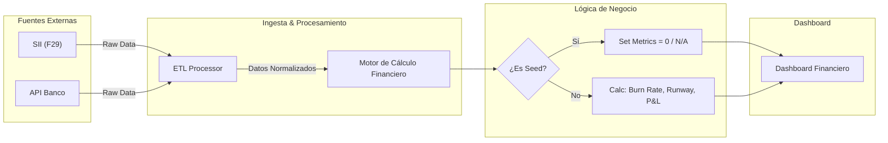

# Briefing Técnico: Desarrollo Plataforma Fintegrity

Este documento detalla la arquitectura, flujos de datos y lógica de negocio para el desarrollo de **Fintegrity**. El sistema se centra en la automatización mediante IA y la integración de APIs para facilitar la gestión entre empresas, patrocinantes e inversionistas.

---

## 1. Lógica Central: Formularios Dinámicos

La plataforma no tiene una estructura fija; se adapta al tipo de fondo o concurso (**Instrumento CORFO**) al que la empresa postula.

*   **Configuración del Patrocinante:** Las aceleradoras o VCs suben sus propias preguntas de postulación.
*   **Mejora con IA (Inputs):** Cuando la empresa responde, el sistema usa un modelo de lenguaje (LLM) para mejorar la redacción y realiza una "investigación profunda" (**Deep Research**) automática para completar datos faltantes, como el tamaño del mercado (TAM/SAM/SOM).
*   **Dependencia de la Etapa:**
    *   **Empresas Semilla/Pre-seed:** El sistema no exige datos de ventas o flujos de caja, ya que están en etapa de idea o concepto.
    *   **Empresas de Escalamiento o I+D:** El sistema activa obligatoriamente los módulos financieros y de tracción comercial avanzada.

### Diagrama de Flujo: Procesamiento de Formularios


---

## 2. Módulo Legal (Carpeta Legal)

Servicio encargado de la validación de identidad (KYC/KYB) y análisis de capacidades del equipo.

### Flujo de Datos
*   **Inputs:** RUT, PDFs (Escrituras), URLs (LinkedIn), Archivos (CVs).
*   **Procesamiento:** Parser de documentos + NLP para extracción de entidades en CVs y LinkedIn.
*   **Outputs:** Grafo de Malla Societaria y Perfil de Capacidades (Skill Matrix).

### Diagrama de Secuencia: Validación de Equipo


---

## 3. Módulo Financiero (Carpeta Financiera)

Monitorización pasiva y automática. Privacidad y seguridad son críticas aquí.

*   **Inputs:**
    *   **SII:** Extracción del formulario **F29** (ventas e impuestos).
    *   **Banco:** Conexión con la cuenta corriente vía API (Ley Fintech).
*   **Lógica de Negocio:**
    *   **Cálculos Automáticos:** El sistema genera el **Estado de Resultados** (P&L) y calcula el **Burn Rate** (gasto mensual) y el **Runway** (tiempo de vida de la caja) usando fórmulas financieras estándar.
    *   **Nota para Devs:** Si es una empresa "Semilla" sin ventas, estos indicadores deben aparecer en cero o como "No aplica" para no bloquear el perfil.

### Diagrama de Flujo de Datos Financieros



---

## 4. Módulo de Negocio y Reputación

Gestión de la prueba social y resumen ejecutivo validado.

*   **One-Pager Inteligente (Output):** Documento que resume la visión de la empresa, validado con los datos reales del banco/SII y el análisis de equipo hecho por la IA.
*   **Reseñas de Clientes (Flujo):**
    1.  La empresa ingresa el correo del cliente.
    2.  El sistema envía un mail desde **Fintegrity** con una encuesta.
    3.  El cliente **debe** loguearse con LinkedIn para responder.
    4.  **Output:** La reseña se publica con el link al perfil real de LinkedIn del cliente para evitar fraudes.


---

## 5. Pipeline de Seguimiento y Reportes

Automatización del reporting ("Pain Killer" para founders). Transforma inputs informales en reportes formales.

*   **Bitácora Quincenal (Input):** Cada 15 días, la empresa escribe 3 puntos: **Logros**, **Bloqueos** y **Próximos Pasos**.
*   **Proceso:** Un modelo de IA toma estas notas simples y redacta un informe de progreso formal y detallado.
*   **Generador de Informes CORFO (Output):**
    *   **Informe Técnico:** Compila las bitácoras quincenales y las actas de mentores en el formato oficial del fondo correspondiente.
    *   **Informe Financiero:** Genera la rendición de gastos cruzando los datos bancarios con las metas de la convocatoria.


---

## 6. Matriz de Control de Acceso (RBAC)

Definición de roles y alcance de datos.

| Rol | Acción Principal | Acceso a Datos | Scope |
| :--- | :--- | :--- | :--- |
| **Empresa** | Postula, conecta APIs, llena bitácora | **Write:** Propio<br>**Read:** Propio | `Private` |
| **Patrocinante** | Configura forms, monitorea | **Read:** Agregado (Portafolio)<br>**Write:** Configuración | `Portfolio-Level` |
| **Consultor** | Sube actas, feedback | **Read:** Asignados<br>**Write:** Comentarios/Actas | `Assigned-Level` |

### Modelo Relacional Simplificado


---

# SEMILLA INICIA CORFO 2026 POSTULACIÓN (Fase 2):

# Fintegrity: Plataforma de Validación de Solvencia mediante IA Multimodal

> **Estado del Proyecto:** Postulación Semilla Inicia 2026  
> **Categoría:** Deep Tech / Fintech / AI  
> **Stack:** Python (PyTorch), Open Finance APIs, React.

---

## 1. Resumen Ejecutivo
**Fintegrity** es una infraestructura de auditoría algorítmica que reemplaza el análisis financiero manual por agentes de **Deep Reinforcement Learning (Deep RL)**. Utilizando el marco de la **Ley Fintech 21.521 (Chile)**, conectamos datos bancarios inmutables con análisis conductual del equipo fundador para emitir un "Sello de Confianza" dinámico en tiempo real.

---

## 2. Flujo de Usuario
El siguiente diagrama describe la interacción desde que la Startup conecta sus cuentas hasta que el Inversionista recibe el análisis de riesgo.

```mermaid
graph TD
    %% Nodos de Usuario
    User([Founder Startup]) -->|1. Login & Auth| Frontend[Plataforma Web Fintegrity]
    VC([Inversionista / VC]) -->|5. Acceso a Dashboard| Dashboard[Panel de Control VC]

    %% Flujo de Datos
    Frontend -->|2. Conexión OAuth 2.1| OpenFin{Gateway Open Finance}
    OpenFin -->|Extracción Inmutable| BankAPI["APIs Bancarias (Ley Fintech)"]
    
    Frontend -->|3. Upload Video Pitch & Founder Interview| VideoServ[Servidor de Medios]
    
    %% Motor de IA
    subgraph "CORE RL AGENT"
        BankAPI -->|Series Temporales| DataPrep("Anonimización & Limpieza")
        VideoServ -->|Vectores Conductuales| NLP_Vision("Modelo NLP + Vision")
        
        DataPrep & NLP_Vision --> Fusion[Fusión Multimodal]
        Fusion --> RL_Agent{{Agente Deep RL}}
        
        RL_Agent -->|10k Simulaciones Monte Carlo| RiskScore("Cálculo de Probabilidad de Quiebra")
    end
    
    %% Salida
    RiskScore -->|4. Generación de Certificado| Blockchain[Sello de Confianza Dinámico]
    Blockchain --> Dashboard
    RiskScore --> Dashboard
